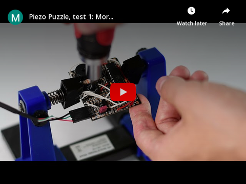
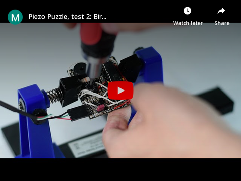
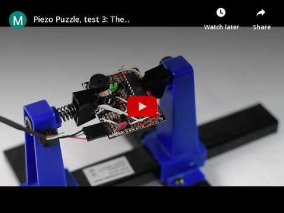
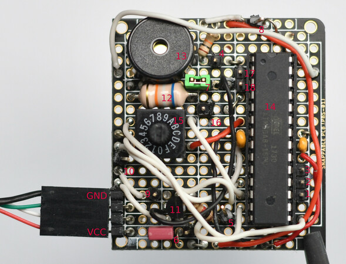

# Piezo Puzzle 🗝️🎹

[](https://github.com/dieret/piezo-puzzle/actions)
[](https://results.pre-commit.ci/latest/github/dieret/piezo-puzzle/main)
[](https://github.com/dieret/piezo-puzzle/blob/main/LICENSE.txt)

An interactive birthday puzzle with a piezo buzzer operated by an atmega8 microcontroller. Different values can be selected on a rotary dial. For each selected value, letter combinations are communicated with morse code. Once their meaning is understood, they can be brought in the right order to get a code. After this code has been entered, three dial values play different birthday songs.

# 📝 Description

The dial has 16 values (0 to 15). All odd positions are skipped (and in the final packaging only these will be marked with numbers/letters). On positions 0, 2, 4, 6, 8, a message is transmitted in morse code (`ECC`, `TEN`, `SMI`, `CAP`, `WHI`):

[](https://www.youtube.com/watch?v=0JKxZiPPPrw)

These codes correspond to the first three letters of actors in a long running TV series. To solve the puzzle, the TV series needs to be identified and the actors need to  be ordered by their appearances. Without correct code, positions 10, 12, 14 give a sound signal indicating failure. With the correct code (`8 2 4 6 0` = `ECC TEN SMI CAP WHI`), positions 10, 12, 14 each play a distinct birthday song. After one of the songs is played, it is possible to switch between the three positions without having to re-enter the code:

[](https://www.youtube.com/watch?v=-bKmOt6dRks)

Finally, in the case that the connection between the letters and the actors isn't made, a letter with a hint is attached to the bottom of the box.
The letter reads "Ask Captain W. Smiten", corresponding to `CAP TEN WHI SMI TEN` = `6 2 0 4 2`. Entering this code will play the theme song of the TV series:

[](https://www.youtube.com/watch?v=Xnw1JbcScsQ)

# 🔌 Hardware

* microcontroller unit (MCU): atmega8
* Input: Rotary switch with 16 positions [`KMR 16`](https://www.reichelt.de/dreh-codierschalter-16-polig-mit-vertikal-achse-kmr-16-p9434.html?&nbc=1). Each position "snaps in place". Also note that the torque required to turn this switch is quite high. In our case this was connected to a larger wheel in the final package and was just perfect, but it is not pleasant to turn this with bare fingers.
* Output: Piezo element. The piezo element is included in a small circuit as described at [electroschematics.com](https://www.electroschematics.com/funny-micro-synthesizer/). We used the following parts: <!-- markdown-link-check-disable-line -->
    * Piezo element [`SUMMER EPM 121`](https://www.reichelt.de/piezo-schallwandler-85-db-4-khz-summer-epm-121-p35927.html?&nbc=1)
    * Transistor [`SC 1815`](https://www.reichelt.de/bipolartransistor-npn-50v-0-15a-0-4w-to-92-sc-1815-p16334.html?&trstct=pos_0&nbc=1). **WARNING: unusual pin configuration**; check first page of data sheet
    * 1K resistor
    * 68 mH inductor [`L-HBCC 68M`](https://www.reichelt.de/festinduktivitaet-axial-hbcc-ferrit-68m-l-hbcc-68m-p86483.html?&nbc=1). The circuit from the source uses 10 mH but that was found to give a slightly less clean sound
* Power supply: Directly via USB cable
    * 40cm cable with USB A female [`DELOCK 83825`](https://www.reichelt.de/usb-pinheader-buchse-auf-usb-a-buchse-40-cm-delock-83825-p163112.html?&nbc=1)
    * Adapter with USB A male <> micro USB A/B female [`DELOCK 65029`](https://www.reichelt.de/usb-micro-b-buchse-auf-usb-2-0-a-stecker-delock-65029-p160326.html?&nbc=1)
    * Adapter with USB A male <> USB A male [`DELOCK 65011`](https://www.reichelt.de/usb-a-stecker-auf-usb-a-stecker-delock-65011-p180114.html?&nbc=1)

### Form factor

Dimensions: Without axis and usb connection 44.5 x 48.35 x 11.5, Offset axis: 5.8

* breadboard thickness + soldering ~ 4mm
* IC + socket + breadboard + soldering ~ 11.5 mm
    * Piezo buzzer less high than that
    * **USB adapter should be put at 90°** to not increase height
* rotary switch: 6mm + 7.3mm (axis) + 4mm (breadboard + soldering)
* Breadboard: 44.5 x 48.35 mm (though usb connection protrudes)

### Circuit



**Warning:** Power supply USB connector is not protected against being connected upside down. Make sure that the orientation is according to this picture!

Letters:

1. `MOSI` connector (used by programmer)
2. `MISO` connector (used by programmer)
3. `SCK` connector (used by programmer)
4. `RESET`/`RST` connector (used by programmer)
5. Debug connector for `PB1` which drives the piezo. Can be e.g. used with a oscilloscope to analyze the wave shape/timing
6. Jumper that connects input voltage VCC with the rest of the board. Can be removed to add a switch later. Right next to it: One more VCC connector.
7. Jumper that disconnects the inductor (basically switches of the sound)
8. `VCC` connector (+5V)
9. `GND` connector (ground)
10. `GND` connector
11. `SC 1815`
12. `L-HBCC 68M`
13. Piezo element `SUMMER EPM 121`
14. atmega8 microcontroller
15. rotary dial `KMR 16`
16. `PD2` connector (not used)
17. `RXD` connector (for uart communication; wasn't used)
18. `TXD` connector (for uart communication; wasn't used)

## 💾 Software

* **Constraints**:
  * Code has to fit in 8KB of flash program memory. The current implementation is already pushing towards this limit with ~6KB.
  * Only 1KB of RAM is available
* **Playing music:** The sound is generated by generating a square wave by rapidly toggling one of the pins of the atmega8 in a simple loop.
  * This is far from ideal, because the time to look up variables, read input signals or toggle the pins impacts the timing and thus the frequency of the tune that is played.
  * **Timing calibration:** To amend this, we have calibrated the time between the toggling to account for delays. Calibration was performed by playing a scale and measuring the frequencies with Audacity. A constant shift of wave lengths was found which is compensated simply by reducing the sleep values in the loop.
  * In retroperspective an interrupt based solution such as shown by [engineersgarage](https://www.engineersgarage.com/waveform-generation-using-avr-microcontroller-atmega16-timers-part-16-46/) would have saved us much trouble.

### Compiling

You might need to

```bash
sudo apt-get install avr-libc
sudo apt-get install gcc-avr
```

Then run:

```bash
cmake -S .
cmake --build .
# To upload to the MCU
cmake --build . --target upload
```

For the last step your programmer must be connected. We used the [Pololu USB AVR Programmer v2.1](https://www.pololu.com/product/3172). Once USB is connected to the programmer, the green light should be lit permanently (if it's blinking the USB cable doesn't offer a data connection). Once power is supplied to the MCU, the two yellow lights should flash. For programming, `VCC`, `GND`, `MOSI`, `MISO`, `SCK`, `RESET` must be connected.

If you get

```
avrdude: ser_open(): can't open device "/dev/ttyACM0": Device or resource busy
```

it helps to run `pavr2cmd --status` for some reason.

### Development setup

```bash
sudo apt-get install clang-format
pre-commit install
```
